# 贷中监控：业务认知与产品方案设计

> 本文服务于零售信贷风控 SaaS 的「贷中监控」模块设计。先讲清楚**贷中监控到底在做什么**（业务认知），再给出**产品方案设计**（多条路线 + 演进建议）。
>
> 参考对象：同盾科技贷中监控（tongdun.cn/product/loan/after）、天策-决策引擎贷中版。
>
> 阅读地图：第 0 章 30 秒看懂 → 第 1 章 为什么有贷中监控 → 第 2 章 监控什么 → 第 3 章 监控之后干什么 → 第 4 章 三种业务流程（现场 / 交互 / 技术）→ 第 5 章 功能模块拆解 → 第 6 章 产品方案（4 选 / 组合）→ 第 7 章 技术要点 → 第 8 章 与现有 Demo 的映射。

---

## 0. 30 秒看懂贷中监控

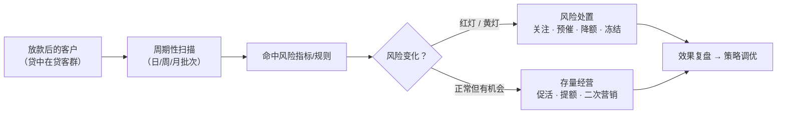

**一句话定义**：贷中监控 = 对**已授信 / 已放款**的客户，在贷款存续期内**持续监测**其风险状况与行为变化，输出**预警信号**，辅助机构做两件事——**控风险**（预催、降额、冻结）和**做经营**（促活、提额、二次营销）。

**与贷前的本质区别**：贷前审核是「进门检查」（一笔一审批，一次做决定）；贷中监控是「在贷期间的不间断体检」（全客群周期扫描，风险是动态变化的，要在变化中及时发现）。

---

## 1. 业务背景：为什么要有贷中监控

### 1.1 信贷全生命周期中，贷中在哪

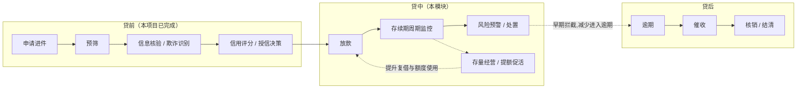

### 1.2 贷中的两大痛点

| 痛点 | 具体表现 | 不做贷中监控的后果 |
|------|---------|------------------|
| **① 风险会变** | 授信时资质正常，放款后收入骤降、多头借贷激增、设备异常、失联、涉诉 | 等到逾期才被动催收，损失已形成；「事后诸葛亮」 |
| **② 存量有金矿** | 在贷客户中大量「优质未提额」「结清未复借」「沉默客户」 | 只做贷前拉新，获客成本高，存量客户价值流失 |

同盾官方对贷中监控的定义（原文摘录）：

> 贷中监控结合贷中贷后丰富的业务场景，为客户提供灵活的策略配置和持续的场景化监控服务，实现对贷中客群全面而精细的管理需求。如在**贷中风控场景**，同盾对授信后借款人的风险变化进行周期性监测和评估，并给出风险预警，辅助客户进行**预催、降额**；在**存量客群运营场景**，同盾对借款人的资产状况、资金需求和行为习惯等进行周期性评估，辅助客户进行**促活、提额、二次客户经营**。

---

## 2. 监控什么：对象 × 内容 × 指标 × 信号

### 2.1 监控对象（客群分层）

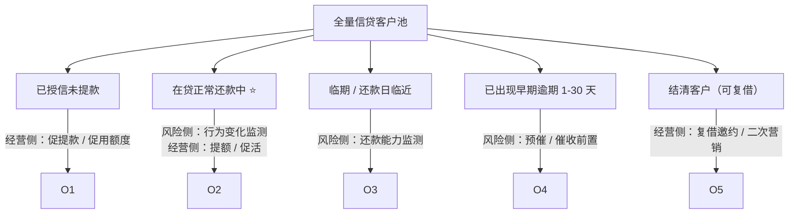

### 2.2 两大业务场景对比

| 维度 | 贷中风险预警（控风险） | 存量客群运营（做经营） |
|------|----------------------|----------------------|
| 目的 | 发现早期风险征兆，减少损失 | 挖掘存量客户价值，增加收益 |
| 监测内容 | 收入变化、负债变化、行为异常、失联风险、涉诉 | 资产状况、资金需求、行为习惯、活跃度 |
| 输出 | 红灯 / 黄灯预警 + 规则明细 | 机会信号（提额 / 促活 / 复借意向） |
| 处置动作 | 关注、预催、降额、冻结、止付 | 促活、提额、二次营销、挽留 |
| 业务方 | 风控部 / 贷后部 | 运营部 / 客户经营部 |

### 2.3 指标体系：从数据到信号的四级结构

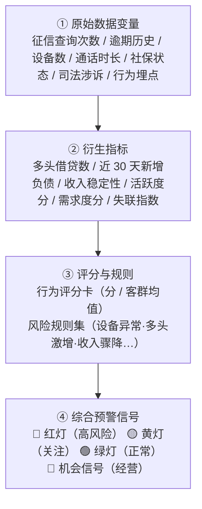

**贷中风险侧常见指标**（示例，可按产品线调整阈值）：

| 类别 | 指标示例 | 触发方向 |
|------|---------|---------|
| 负债变化 | 近 30 天新增贷款笔数 / 金额、多头借贷机构数 | 上升 = 风险 |
| 收入变化 | 社保代缴中断、工资代发金额骤降、公积金断缴 | 中断/骤降 = 风险 |
| 行为异常 | 频繁更换设备、异地登录、夜间大额交易、联系人多号复用 | 异常 = 风险 |
| 失联风险 | 主叫通话时长骤减、催收联系失败次数 | 下降/失败 = 风险 |
| 司法风险 | 新增被执行 / 失信 / 涉诉记录 | 出现 = 高风险 |
| 还款能力 | 临期账户余额不足、还款日前取现 | 出现 = 预警 |

**存量经营侧常见指标**：

| 类别 | 指标示例 | 触发方向 |
|------|---------|---------|
| 资产状况 | 存款 / 理财 / 资产流入流出 | 上升 = 提额机会 |
| 资金需求 | 主动查额、提额申请、额度使用率上升 | 上升 = 促贷机会 |
| 行为习惯 | APP 活跃度、活动点击、浏览借款页 | 上升 = 促活机会 |
| 复借意愿 | 结清后活跃、老客户回访 | 出现 = 复借机会 |

### 2.4 红黄灯综合预警信号

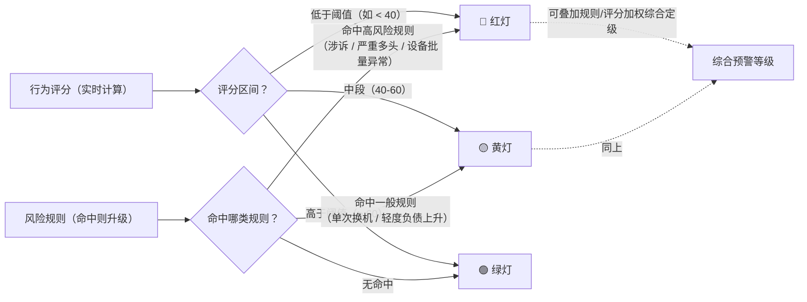

**信号还原（合规 + 可解释）**：每条预警必须能「还原规则明细」——为什么红、哪条规则命中、评分多少、涉及哪些指标值。这是同盾产品的硬要求（业务解释性强），也是监管对「自动化决策可解释」的要求。

| 信号 | 含义 | 建议动作 | 示例触发 |
|------|------|---------|---------|
| 🔴 红灯 | 高风险，需尽快处置 | 预催 / 降额 / 冻结 / 人工核实 | 新增被执行记录、3 个月负债翻倍 |
| 🟡 黄灯 | 关注级，持续跟踪 | 加观察名单 / 提示客户经理 | 换设备、还款日前余额不足 |
| 🟢 绿灯 | 正常，无需动作 | — | 各项指标平稳 |
| 🔵 机会信号 | 经营机会（部分产品用蓝/橙标识） | 提额 / 促活 / 复借邀约 | 额度使用率 80%+ 且评分上升 |

---

## 3. 监控之后干什么：处置闭环

**核心认知：监控本身不是目的，处置闭环才是。** 预警出来没人跟 = 白监控。

### 3.1 处置动作清单

| 方向 | 处置动作 | 触发场景 | 执行方 |
|------|---------|---------|--------|
| 风险侧 | **关注**（进观察名单） | 黄灯 / 轻度异常 | 风控专员 |
| 风险侧 | **预催**（还款提醒前置） | 红灯且临期 | 催收系统 / 电催 |
| 风险侧 | **降额**（额度动态调减） | 红灯 / 风险持续恶化 | 系统自动 or 审批后执行 |
| 风险侧 | **冻结 / 止付** | 严重红灯（涉诉、欺诈迹象） | 审批后执行 |
| 风险侧 | **提前回收** | 风险不可控 | 资管 / 贷后部 |
| 经营侧 | **促活**（发券 / 提醒） | 机会信号 | 运营部 |
| 经营侧 | **提额**（额度上调） | 优质客户需求上升 | 系统自动 or 审批后执行 |
| 经营侧 | **二次营销**（复借 / 交叉销售） | 结清客户 / 沉默客户 | 运营部 |

### 3.2 处置闭环流程

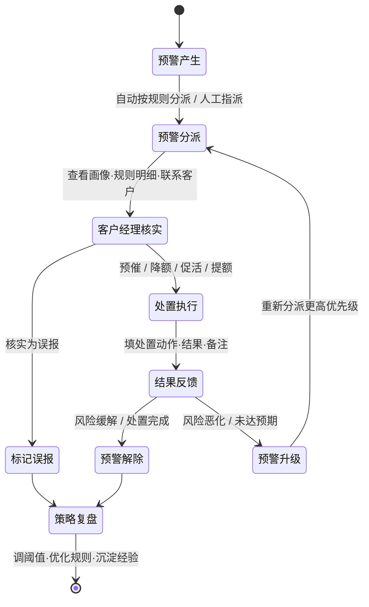

### 3.3 价值量化（为什么值得做）

| 指标 | 含义 | 示例目标 |
|------|------|---------|
| 预警命中率 | 预警客户中确有风险的占比 | 红灯 ≥ 60% |
| 误报率 | 核实为误报的比例 | ≤ 20% |
| 处置及时率 | 红灯 24h 内处置占比 | ≥ 90% |
| 预催挽回率 | 预催后避免逾期 / 提前回收金额 | 视客群而定 |
| 提额转化率 | 提额邀请后实际使用率 | ≥ 30% |
| 复借转化率 | 结清客户二次申请转化 | ≥ 15% |

---

## 4. 业务流程：三个视角

### 4.1 现场实际工作流程（风控专员的一天）

> 以一家消金公司贷后管理部的日常为例，把「系统在背后干了什么」和「人每天在干什么」对上。

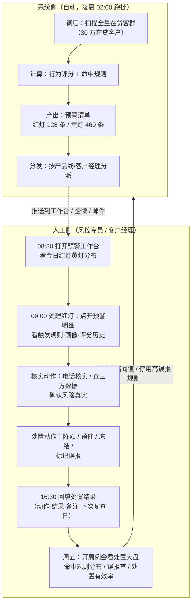

**现场工作的关键点**：
- 专员不是「看报表」，而是「处理工单」——每个红灯是一个待办，跟进到关闭；
- 核实靠的是**规则明细还原 + 客户画像 + 三方数据交叉验证**；
- 处置结果必须回填，否则无法复盘策略好坏；
- 每周复盘推动策略迭代（阈值、规则、客群切分持续调优）。

### 4.2 系统交互流程（角色 × 系统）

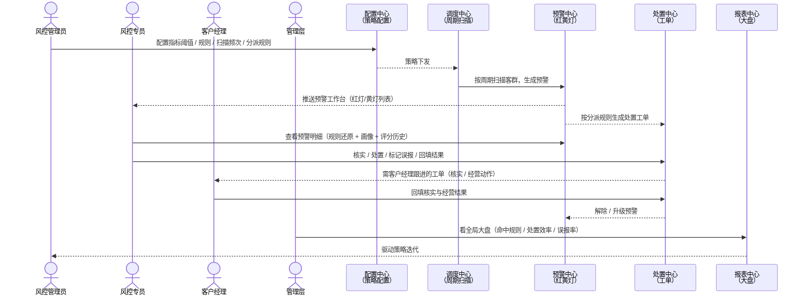

### 4.3 技术流程（数据 → 信号 → 输出）

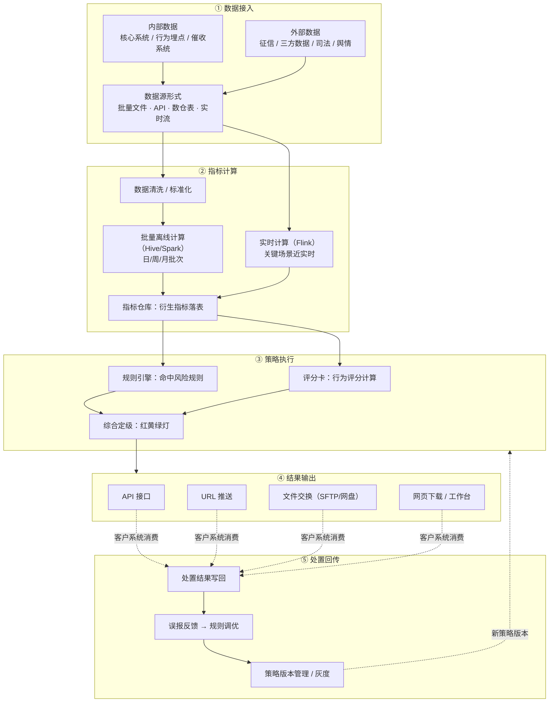

---

## 5. 功能模块拆解（对照同盾五大能力）

| 同盾原文能力 | 拆解出的功能模块 | 关键设计点 |
|-------------|----------------|-----------|
| ① 持续性周期监测评估 | **扫描调度**：日 / 周 / 月 / 自定义频次；全量 or 增量客群 | 跑批窗口、性能（千万级客群）、失败重跑 |
| ② 分场景分产品监测 | **策略配置**：按产品线 × 业务场景 × 客群分层配置监控策略 | 策略 = 指标集 + 规则 + 阈值 + 频次 + 分派 |
| ③ 红黄灯综合预警信号 | **预警中心**：红黄灯定级 + 规则明细还原 + 预警列表 | 可解释（还原触发规则）、定级逻辑透明 |
| ④ 模块化灵活定制 | **模块市场**：指标 / 规则 / 评分卡按业务自由挑选组装 | 面向自主建模客户，从指标到规则到评分全可配 |
| ⑤ 多方式获取结果 | **输出通道**：API / URL 推送 / 文件交换 / 网页下载 | 订阅式推送、结果格式契约、重试机制 |
| （补充，实际必须） | **处置管理**：工单分派 / 核实 / 处置 / 解除 / 复盘 | 没有处置闭环，预警就是摆设 |

---

## 6. 产品方案：四条路线

> 目标客户分层决定方案形态。以下四个方案可按客户类型交付，也可演进组合。

### 方案 A：轻量预警台（开箱即用）

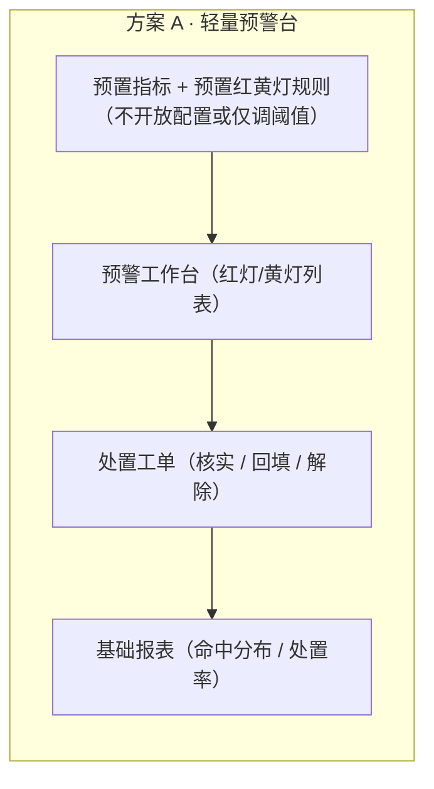

- **目标客户**：中小机构，无建模团队，要「今天上线明天用」。
- **核心卖点**：行业最佳实践预置（同盾专家经验沉淀），开箱即用，只调阈值不改结构。
- **缺点**：灵活度低，客户不能自定义规则。

### 方案 B：同盾式策略配置中心（行业标准形态）

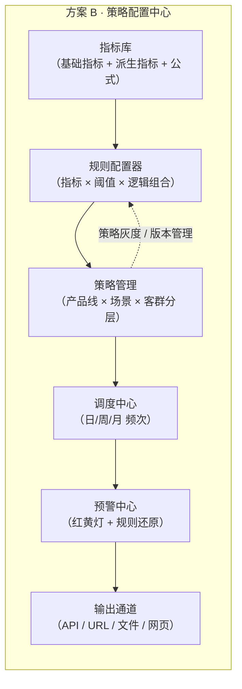

- **目标客户**：有风控团队，想自主配置策略的机构。
- **核心卖点**：同盾原文五大能力的标准落法——指标库 + 规则配置 + 分产品分场景策略 + 多频次调度 + 多渠道输出。
- **与方案 A 的关系**：A 是 B 的「预置好内容的瘦身版」，B 是 A 打开配置能力后的完整版。

### 方案 C：模块化自主建模（天策式）

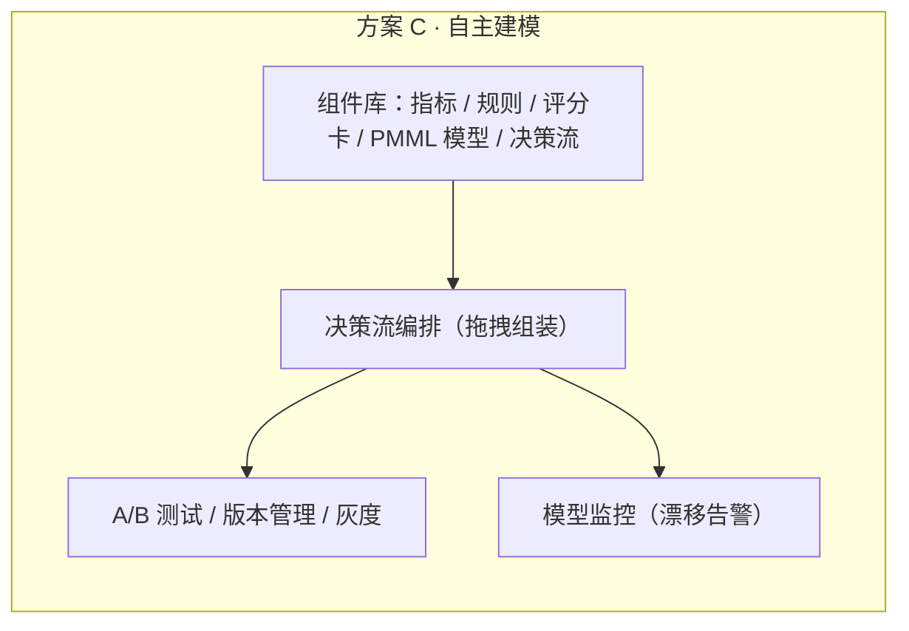

- **目标客户**：头部机构，有建模团队，深度自主可控。
- **核心卖点**：对应同盾「模块化灵活定制」+ 天策决策引擎——组件自由挑选组装，模型在线编辑与版本管理，模型漂移自动告警。
- **工程成本**：最高，相当于把决策引擎能力开放给客户。

### 方案 D：神策式 BI 监控（指标 × 看板 × 下钻个体）

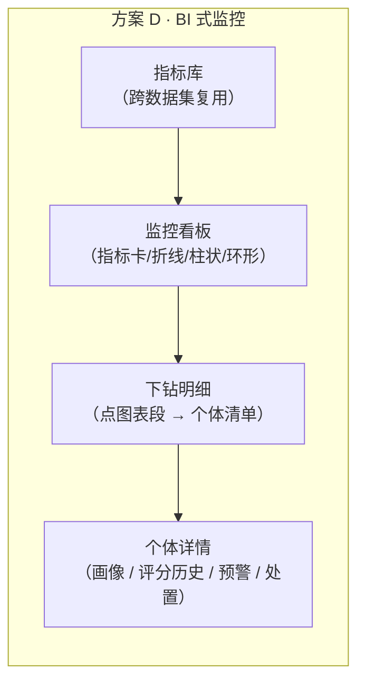

- **目标客户**：重视数据分析与精细化运营的机构（数据分析师、运营岗用）。
- **核心卖点**：从宏观指标一路下钻到单个客户——「30 万客群预警分布 → 设备异常场景 46 人 → 张*明的画像与处置历史」。**与 0803 的 BI 规划一脉相承，是现有 Demo 地基最顺的路**。
- **与 B 的关系**：B 解决「怎么监控」，D 解决「怎么看结果、怎么追到个体」，二者互补。

### 方案对比与演进建议

| 维度 | A 轻量预警台 | B 策略配置中心 | C 自主建模 | D BI 监控 |
|------|------------|---------------|-----------|----------|
| 目标客户 | 中小机构 | 有风控团队机构 | 头部机构 | 重数据分析机构 |
| 配置自由度 | 低（调阈值） | 中（配规则策略） | 高（建模型） | 中（指标看板） |
| 开箱体验 | ⭐⭐⭐⭐⭐ | ⭐⭐⭐ | ⭐⭐ | ⭐⭐⭐⭐ |
| 工程复杂度 | 低 | 中 | 高 | 中 |
| 与 0803 BI 规划 | 无关 | 部分共用指标库 | 无关 | **直接延续** |
| 处置闭环 | ✅ | ✅ | ✅ | 需配套 |

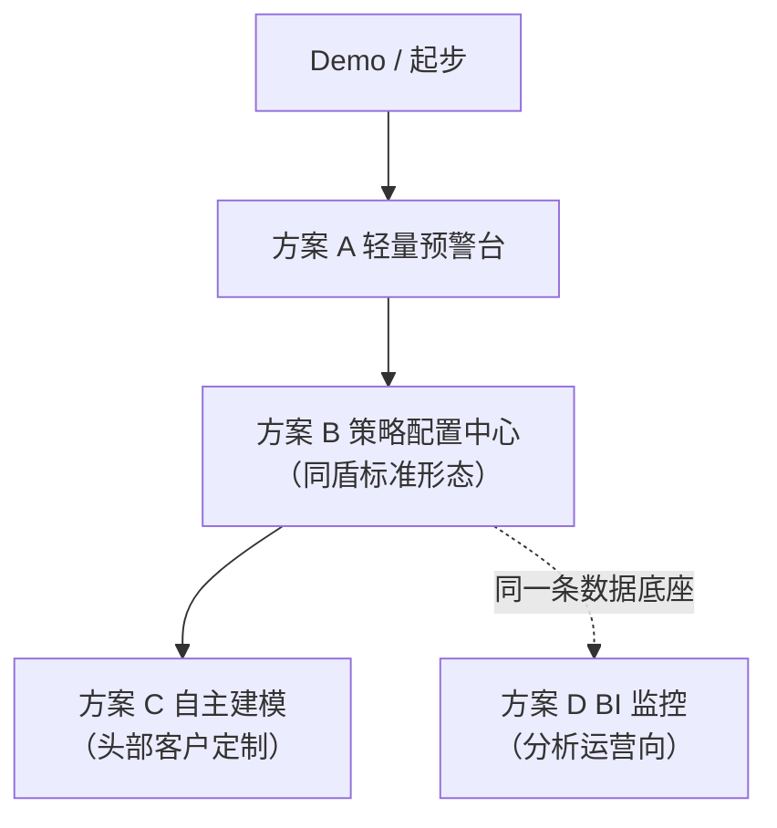

**给本项目（Demo）的建议**：**B + D 融合**——
- 用 0803 规划把「指标库 + 看板 + 下钻 + 个体详情」落地（方案 D 已经定了地基）；
- 在其中嵌入「红黄灯预警 + 规则明细还原 + 处置工单」模块（方案 B 的预警中心部分），让 BI 不只是看数，还能追到处置闭环；
- 预警工作台 / 处置工单与现有「申贷审核」的人工审核、报告详情风格保持一致，形成「贷前审核 + 贷中监控」的完整故事线。

---

## 7. 技术实现要点（Demo 口径）

| 环节 | 说明 |
|------|------|
| 数据来源 | Demo 用本地 JSON 模拟（延续 `templateSeed.json` 模式），字段按「指标/维度/个体主键」设计，保证可下钻 |
| 指标计算 | 延续 `buildComputed` 引擎 + 0803 的指标公式引擎（派生指标：逾期率、迁移率、环比） |
| 预警规则 | 规则 = 指标 + 阈值 + 逻辑，存 JSON，配置即行为；预警事件带**规则明细快照**（触发规则、指标值、评分） |
| 红黄灯定级 | 评分区间 + 规则命中加权，定级逻辑可配置、可还原 |
| 处置闭环 | 预警状态机：`待处置 → 核实中 → 处置中 → 已解除 / 已升级 / 误报`；操作记录进操作日志（对齐报告人工审核的做法） |
| 多方式输出 | Demo 至少演示「网页下载（工作台）」+ 预留 API/URL 推送/文件交换的配置占位 |
| 客群规模 | 千万级是真实系统的性能叙事；Demo 展示 20-30 个个体样例即可讲通 |

**预警事件数据结构（示意）**：

```jsonc
{
  "alertId": "AL20260804-0001",
  "custId": "C0001",
  "custName": "张*明",
  "product": "信用贷",
  "scene": "贷中风险预警",
  "level": "RED",                  // RED / YELLOW / GREEN / OPPORTUNITY
  "alertDate": "2026-08-04",
  "reason": [                       // 规则明细还原（可解释）
    { "rule": "近30天新增贷款笔数>=3", "value": 5, "threshold": 3 },
    { "rule": "行为评分 < 40", "value": 33, "threshold": 40 }
  ],
  "score": { "value": 33, "cohortAvg": 62, "trend": -12 },
  "status": "待处置",
  "assignee": "客户经理-李四",
  "dispose": []
}
```

---

## 8. 与现有 Demo 系统的映射

| 0803 规划 / 现有资产 | 贷中监控落地映射 |
|---------------------|----------------|
| 10 个内置数据集（`ds_alert` / `ds_alert_daily` / `ds_dispose_task` / `ds_dispose_result`…） | 预警明细、处置工单数据集——补个体粒度 `cust_id` 后直接支持下钻 |
| 7 个默认看板（`MidDashboardPage`） | 方案 D 的看板层，直接继承渲染 |
| 指标库（0803 规划的 `metrics.json` + 公式引擎） | 方案 B 的指标库，同一套 |
| 下钻明细 + 个体详情（0803 规划的 E/F/G） | 方案 D 的 D3/D4，预警→个体→处置记录闭环 |
| 报告模板 / 人工审核状态机（贷前模块） | 处置工单状态机、操作日志可复用同款模式 |
| 数据来源标签（蓝=配置 / 橘=用户数据 / 灰=实时算法，贷前模块已用） | 贷中监控同样标注，延续产品一致性 |

---

## 附录 A：术语表

| 术语 | 含义 |
|------|------|
| 贷中 | 放款后至结清/逾期前的贷款存续期 |
| 贷中监控 | 对在贷客群持续扫描监测、输出预警的管理过程 |
| 红黄灯 | 综合预警信号分级：红=高风险需处置，黄=关注，绿=正常 |
| 预催 | 逾期前的还款提醒与催收前置动作 |
| 降额 | 动态调减客户可用额度，控制敞口 |
| 促活 | 激活沉默/低活跃客户的运营动作 |
| 提额 | 对优质客户上调额度 |
| 二次客户经营 | 对结清/存量客户做复借、交叉营销 |
| 规则明细还原 | 预警事件中记录触发规则、指标值、阈值，保证可解释 |
| 策略配置中心 | 指标库+规则+策略+调度+输出的配置管理能力 |
| 下钻 | 从聚合图表点入明细/个体详情的交互链路 |
