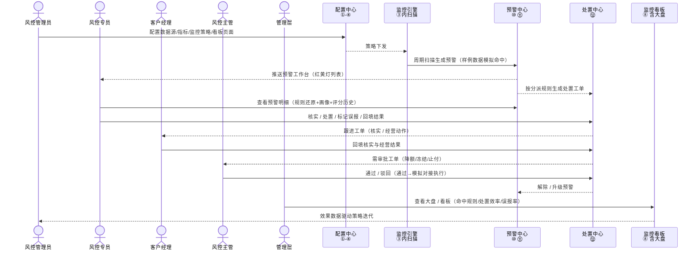

# 贷中监控 · 功能矩阵与页面规划总览

> 本文档整合三部分，**内容互相一致**：
> ① 贷中监控用户 × 功能矩阵（角色 × 功能模块）
> ② 系统交互流程图（时序图，v3 页面更新版）
> ③ 页面功能规划（v3 精简版，10 页）
>
> 页面编号：①-④⑦ 配置域 ｜ ⑧⑩⑪⑫ 使用域（沿 v3 规划）。配置页照贷前「报告模板」成熟模式实现（本地 JSON + 配置即渲染 + 蓝/橘/灰数据来源标注）。

---

## 1. 角色定义

| 角色 | 定位 | 主要动作 | Demo 保留 |
|------|------|---------|-----------|
| 风控管理员 | 唯一「生产角色」 | 配置数据源/指标/策略/看板，调阈值 | ✅ |
| 风控专员 | 处置主力 | 工作台处理红黄灯、处置回填 | ✅ |
| 客户经理 | 前线核实员 | 接收跟进工单、核实、经营动作回填 | ✅ |
| 风控主管 | 审批闸门 | 审批降额/冻结/止付、策略上线 | ✅（审批做成流程内嵌步骤） |
| 管理层 | 只看结果 | 大盘总览 | ✅ |
| 系统管理员 | 平台管家 | 权限/对接运维 | ❌ 砍掉（权限写死） |

## 2. 用户 × 功能矩阵

> 功能模块对应页面编号见括号；「—」= 该角色不涉及。

| 功能模块 | 风控管理员 | 风控专员 | 客户经理 | 风控主管 | 管理层 |
|---------|-----------|---------|---------|---------|--------|
| **A. 策略配置** ① 数据源 ② 指标库 ③ 监控策略 ④ 监控页面 | 定义数据源、建指标、配规则/任务/处置策略、配看板布局 | 查看已生效策略 | — | 审批策略上线/变更 | 查看 |
| **B. 预警管理** ⑩ 预警工作台 ⑪ 个体详情（规则还原） | 按命中率/误报率调阈值 | **核心**：工作台逐条处理——明细、核实、处置、误报 | 查看名下客户预警、配合核实 | 查看高优预警、审批升级 | 看预警分布 |
| **C. 处置管理** ⑫ 处置工单 ⑪ 处置操作 | 配动作对接字段、分派规则 | 处置回填、解除/升级 | **接收跟进工单**、回填经营结果 | **审批降额/冻结/止付**（通过→模拟对接执行） | 看处置效率 |
| **D. 报表分析** ⑧ 监控看板（含大盘） | 看策略效果、找优化点 | 看个人绩效 | 看客户经营 | 看部门指标 | 看全局大盘 |
| **E. 系统管理** | —（对接/输出能力已并入③） | — | — | — | — |

## 3. 系统交互流程（v3 更新版）

### 3.1 时序图

### 3.2 模块 ↔ 页面映射（保证与时序图一致）

| 时序图模块 | 对应页面 | 职责 |
|-----------|---------|------|
| 配置中心 | ① 数据源管理 ② 指标库 ③ 监控策略配置 ④ 监控页面配置 | 全部配置动作 |
| 监控引擎 | ③ 内「监控任务」 | 周期扫描、产出预警（Demo：样例数据模拟命中，无独立页面） |
| 预警中心 | ⑩ 预警工作台 ⑪ 个体详情页 | 预警队列 + 规则还原 + 单客视图 |
| 处置中心 | ⑫ 处置工单页 | 工单跟进、回填、审批、状态机 |
| 监控看板 | ⑧ 监控看板（含预置大盘页） | 统计视图、下钻、导出 |

### 3.3 读图五回合

| 回合 | 消息 | 讲什么 |
|------|------|--------|
| ① 配置 | 管理员→配置中心→监控引擎 | 管理员把六段配置好，策略下发（纯后台） |
| ② 扫描 | 监控引擎→预警中心 | 到点扫描客群，生成红黄灯预警（样例模拟） |
| ③ 分发 | 预警中心→专员/处置中心 | 推送工作台 + 按分派规则生成工单 |
| ④ 处置 | 专员/经理/主管 ↔ 处置中心 | 明细核实 → 处置回填 → 经理跟进 → **主管审批** → 解除/升级 |
| ⑤ 复盘 | 管理层→看板→管理员 | 看大盘效果数据，驱动策略迭代（闭环） |

## 4. 页面功能规划（10 页）

### 4.1 页面清单

| # | 页面 | 域 | 主要用途 | 角色 |
|---|------|----|---------|------|
| ① | 数据源管理 | 配置 | 对接多种数据源，为指标库提供字段与样例数据 | 管理员 |
| ② | 指标库 | 配置 | 定义可复用指标（基础+派生），全系统引用 | 管理员 |
| ③ | 监控策略配置 | 配置 | 监控任务 / 预警规则 / 红黄灯定级 / 处置策略（含动作对接与输出方式） | 管理员 |
| ④ | 监控页面配置 | 配置 | 看板页面与组件配置（展示布局） | 管理员 |
| ⑦ | 报告模板 | 配置 | 贷前四类报告模板（已完成，独立保留） | 管理员 |
| ⑧ | 监控看板 | 使用 | 查看指标数据：多页面渲染 + 预置大盘 + 下钻 + 导出 | 专员/经理/管理层 |
| ⑩ | 预警工作台 | 使用 | 红黄灯预警任务队列，逐条处理 + 导出/推送模拟 | 专员 |
| ⑪ | 个体详情页 | 使用 | 单客全视图：规则还原+画像+评分历史+处置（模拟对接执行） | 专员/经理 |
| ⑫ | 处置工单页 | 使用 | 工单跟进、处置回填、审批流转 | 专员/经理/主管 |

### 4.2 页面详述

**① 数据源管理** — 数据底座
数据源列表（类型/连接状态/字段数）｜ 新建数据源（本地样例 / API / 数据库 SQL 占位 / 文件占位）｜ 连接配置（鉴权、字段映射）｜ 字段清单（key/标签/类型/维度度量/单位）｜ 数据预览（前 N 行）｜ 同步/测试（模拟成功失败）。

**② 指标库** — 指标一等公民
指标列表（名称/数据源/类型/公式/单位/被引用次数）｜ 基础指标（字段+聚合 sum/count/avg/max/min/distinct）｜ 派生指标（公式编辑器：字段/指标引用 + 四则 + ratio/mom/yoy/cumsum + 实时预览）｜ 分组搜索 ｜ 删除引用检查 ｜ 复制。

**③ 监控策略配置** — 核心配置页，三个 tab
- **监控任务**：任务列表 + 编辑（客群选择：全量/按产品/按风险分层；指标绑定引②；扫描频次 日/周/月；输出方式：API/URL 推送/文件/网页下载）
- **预警规则**：规则列表（指标+阈值+逻辑）；红黄灯定级配置（评分区间+规则命中加权，可配置可还原）；规则明细还原模板
- **处置策略**：预警等级→建议动作映射（红灯→预催+降额、黄灯→关注、机会信号→提额）；**每个动作自带对接字段**（对接系统/需审批/需触达客户）；分派规则（产品/等级→专员/经理）

**④ 监控页面配置** — 展示布局
页面管理（新建/复制/启停/排序/分组/预览/动态菜单）｜ 组件配置（指标卡/折线/柱状/环形/数据表；指标引②）｜ 下钻配置（明细/个体）｜ 全局筛选器（日期/产品/客群/等级联动）。

**⑦ 报告模板** — 已完成，独立保留
贷前四类报告模板（信息核验/信用风控/欺诈识别/进件审核），作为贷中监控配置页的实现范本。

**⑧ 监控看板** — 数据可视化
按④渲染多页面看板 ｜ 预置「监控大盘」页（预警量/红黄灯分布/命中规则 TOP/处置效率，管理层）｜ 全局筛选 ｜ 点击下钻（柱子/扇区/数据点/行 → 明细列表或⑪）｜ 导出按钮（CSV/JSON 样例）。
数据来源：样例=橘（buildComputed 实时聚合）+ 实时=灰。

**⑩ 预警工作台** — 专员核心
统计头（今日红/黄、待处置、及时率）｜ 预警列表（等级/场景/产品/状态筛选）｜ 预警行（客户脱敏/等级/场景/时间/建议动作/操作）｜ 行操作（查看明细→⑪、立即处置→⑫、批量分派）｜ 规则预览（命中快照）｜ 推送模拟弹窗（按任务输出方式展示 API/URL/文件记录）+ 导出。
数据来源：样例=橘。

**⑪ 个体详情页** — 单客全视图
客户画像卡（脱敏身份/产品/额度/在贷状态/风险等级）｜ **预警规则还原**（命中规则：规则名/指标值/阈值/结论 + 行为评分 vs 客群均值趋势）｜ 评分历史（12 个月折线+月度表）｜ 预警记录 ｜ 处置记录 ｜ 处置操作（按钮按③动作渲染 → **模拟对接执行弹层**：下发→审批→核心系统执行成功/失败 → 回填）｜ 钻入来源回显 ｜ 单客导出。
数据来源：样例=橘（customers.json）+ 实时=灰。

**⑫ 处置工单页** — 协作闭环
我的工单（待跟进/待回填/已完成，按角色分流：专员=处置、经理=核实、主管=审批）｜ 工单详情（客户→⑪、预警、建议动作、对接摘要）｜ 处置回填（动作/结果 成功·失败·误报·升级/备注/下次复查日）｜ 审批操作（配置了「需审批」的动作：通过/驳回，通过后展示模拟对接执行轨迹）｜ 状态机（待处置→核实中→处置中→已解除/已升级/误报；操作日志留痕）。
数据来源：样例=橘。

## 5. 三者一致性对照

| 功能模块（矩阵） | 时序图模块 | 页面编号 | 一句话职责 |
|-----------------|-----------|---------|-----------|
| A 策略配置 | 配置中心 + 监控引擎 | ①②③④（⑦ 范本） | 配好一切 + 周期扫描产出预警 |
| B 预警管理 | 预警中心 | ⑩⑪ | 队列处理 + 规则还原 |
| C 处置管理 | 处置中心 | ⑫⑪ | 工单协作 + 单客处置（含主管审批） |
| D 报表分析 | 监控看板 | ⑧（含大盘） | 统计视图 + 下钻 + 导出 |
| E 系统管理 | —（能力并入③） | — | Demo 不单列 |

**闭环一句话**：管理员把 A 配好 → 系统产出预警 → 专员在 B 处理、在 C 闭环（经理核实、主管审批）→ 管理层在 D 看效果 → 效果数据回来指导 A 的调整。

## 6. 实施顺序（每阶段可独立验收）

| 阶段 | 内容 | 验收标准 |
|------|------|---------|
| **P0 数据底座** | ① 数据源 + ② 指标库 + 样例数据 | 能建数据源、建基础/派生指标并实时预览 |
| **P1 策略** | ③ 监控策略（任务/规则/定级/处置建议+对接字段） | 能配置一个完整监控策略并保存 |
| **P2 展示配置** | ④ 监控页面配置（指标引用/下钻/全局筛选） | 配置页能引用指标库、配下钻 |
| **P3 可视化** | ⑧ 看板渲染（大盘预置/下钻/导出）+ ⑪ 个体详情 | 看板 → 点击 → 个体详情全链路走通 |
| **P4 处置闭环** | ⑫ 工单（审批/回填/状态机）+ ⑩ 预警工作台 + 模拟对接与推送演示 | 处置闭环流转、工作台作业流畅，全链路演示完整 |
