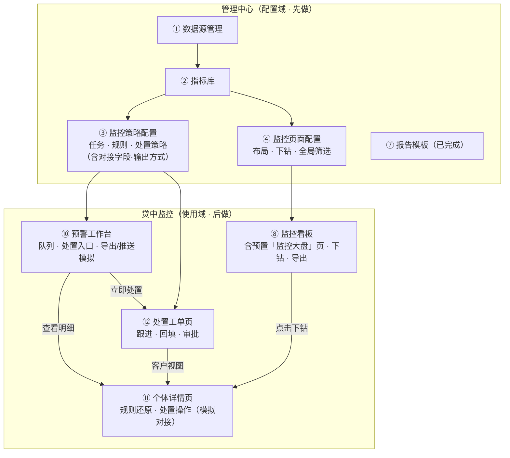
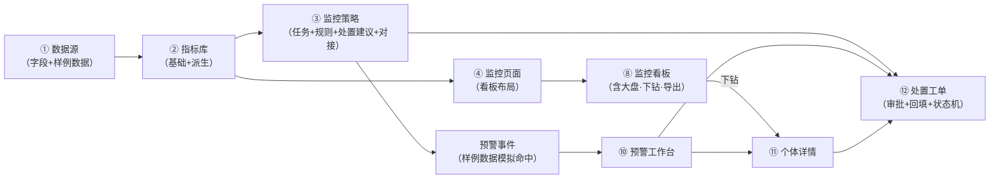

# 贷中监控 · 完整页面规划（纯业务版 v3 · 精简）

> 在 v2（13 页）基础上按评审精简：**砍掉 ⑤ 处置对接配置 / ⑥ 输出通道配置 / ⑬ 下载中心 三个独立页面（能力收编），⑨ 监控大盘并入 ⑧ 监控看板（预置页）**，共 10 页。
> 唯一承认的现状：贷前「报告模板」已成熟完成——贷中监控配置页照它的模式做（本地 JSON 持久化、配置即渲染、蓝/橘/灰数据来源标注）。
> 定位：先做配置侧，再做使用侧；使用侧渲染由配置驱动，数据用样例数据兜底。

---

## 1. 页面清单（10 页）

| # | 页面 | 域 | 主要用途 | 使用角色 |
|---|------|----|---------|---------|
| ① | 数据源管理 | 配置 | 对接多种数据源，为指标库提供字段与样例数据 | 管理员 |
| ② | 指标库 | 配置 | 定义可复用指标（基础+派生），全系统引用 | 管理员 |
| ③ | 监控策略配置 | 配置 | 监控任务 / 预警规则 / 红黄灯定级 / 处置策略（含动作对接与输出方式） | 管理员 |
| ④ | 监控页面配置 | 配置 | 看板页面与组件配置（展示布局） | 管理员 |
| ⑦ | 报告模板 | 配置 | 贷前四类报告模板（已完成，独立保留） | 管理员 |
| ⑧ | 监控看板 | 使用 | 查看指标数据：多页面渲染 + 预置大盘 + 下钻 + 导出 | 专员/经理/管理层 |
| ⑩ | 预警工作台 | 使用 | 红黄灯预警任务队列，逐条处理 + 导出/推送模拟 | 专员 |
| ⑪ | 个体详情页 | 使用 | 单客全视图：规则还原+画像+评分历史+处置（模拟对接执行） | 专员/经理 |
| ⑫ | 处置工单页 | 使用 | 工单跟进、处置回填、审批流转 | 专员/经理/主管 |
| ⑬(砍) | ~~下载中心~~ | — | 已并入 ⑧⑩ 的导出按钮，独立页删除 | — |
| ⑤⑥⑨(砍/并) | ~~处置对接配置 / 输出通道配置 / 监控大盘~~ | — | 能力收编见 §3 | — |

## 2. 页面全景图

## 3. 被砍页面的能力去哪了（防缺漏）

| 原页面 | 去向 |
|--------|------|
| ⑤ 处置对接配置 | → **③ 监控策略 · 处置策略 tab**：每个处置动作自带「对接系统 / 需审批 / 需触达」字段；审批操作在 ⑫ 工单内；模拟执行轨迹在 ⑪⑫ 操作时弹层展示 |
| ⑥ 输出通道配置 | → **③ 监控策略 · 监控任务 tab**：任务带「输出方式」字段（API / URL 推送 / 文件 / 网页）；「多方式获取结果」在 ⑩ 工作台的「推送模拟」弹窗 + ⑧⑩ 的导出按钮演示 |
| ⑨ 监控大盘 | → **⑧ 监控看板**：用 ④ 预置第一个页面「监控大盘」（预警量/红黄灯分布/命中规则 TOP/处置效率），零开发，管理层查看 |
| ⑬ 下载中心 | → **⑧⑩⑪ 各页通用「导出」按钮**：导出 CSV/JSON 样例，导出历史在弹窗内 |

---

## 4. 页面详述

### ① 数据源管理（配置域 · 数据底座）

**用途**：指标库的「水龙头」——管理所有数据接入来源，统一字段口径。

| 功能点 | 说明 |
|--------|------|
| 数据源列表 | 名称 / 类型 / 连接状态（已连接·失败）/ 更新时间 / 字段数 |
| 新建数据源 | 本地样例（内置 JSON） / API / 数据库（SQL 占位） / 文件导入（占位） |
| 连接配置 | API：地址 + 鉴权 + 字段映射；SQL：连接串 + 查询语句（占位演示） |
| 字段清单 | 字段 key / 标签 / 类型（string·number·date）/ 维度 or 度量 / 单位 |
| 数据预览 | 前 N 行样例数据预览 |
| 同步 / 测试 | 手动同步、测试连接（Demo：模拟成功/失败） |

**关系**：② 从这里选字段。数据来源：连接配置=蓝，样例数据=橘。

### ② 指标库（配置域 · 核心公共资产）

**用途**：指标作为「一等公民」——配置一次，被监控策略、看板组件、预警规则反复引用。

| 功能点 | 说明 |
|--------|------|
| 指标列表 | 名称 / 所属数据源 / 类型（基础·派生）/ 公式 / 单位 / 小数位 / 被引用次数 |
| 基础指标 | 选数据源 → 选字段 → 选聚合（sum/count/avg/max/min/distinct） |
| 派生指标 | 公式编辑器：字段/指标引用 + 四则运算 + 函数（ratio/mom/yoy/cumsum）+ 变量面板 + 实时预览 |
| 分组 / 搜索 | 按业务分组（风险/经营）、按名称搜索 |
| 引用检查 | 删除被引用指标 → 提示并阻止，列出引用方 |
| 复制 | 快速派生新指标 |

**关系**：③ 预警规则、④ 看板组件均引用指标。数据来源：配置=蓝。

### ③ 监控策略配置（配置域 · 核心页面）

**用途**：回答「监控什么、怎么判、命中后怎么办、结果怎么送」——一个页面三个 tab，围绕监控任务统一心智。

| Tab | 功能点 |
|-----|--------|
| **监控任务** | 任务列表（名称/客群/扫描频次/状态/输出方式）；任务编辑：客群选择（全量在贷/按产品/按风险分层）、指标绑定（引②）、扫描频次（日/周/月）、**输出方式**（API / URL 推送 / 文件 / 网页下载） |
| **预警规则** | 规则列表（指标 + 阈值 + 逻辑组合）；**红黄灯定级配置**（行为评分区间 + 规则命中加权，可配置、可还原）；规则明细还原模板（预警事件快照字段） |
| **处置策略** | 预警等级 → 建议动作映射（红灯→预催+降额、黄灯→关注、机会信号→提额）；**每个动作自带对接字段**（对接系统：核心信贷/催收/营销/触达/工单；需审批：是/否；需触达客户：是/否）；分派规则（按产品线/等级 → 专员/客户经理） |

**关系**：策略生效后产生预警（Demo 由样例数据模拟命中）；动作对接与审批在 ⑪⑫ 执行演示。数据来源：配置=蓝。

### ④ 监控页面配置（配置域 · 展示布局）

**用途**：回答「监控结果怎么展示」——神策式看板配置。

| 功能点 | 说明 |
|--------|------|
| 页面管理 | 新建/复制/启停/排序/分组/预览/恢复默认；动态挂菜单 |
| 组件配置 | 指标卡 / 折线 / 柱状 / 环形 / 数据表；选数据集 → 指标（引②）→ 维度 → 筛选 |
| 下钻配置 | 无 / 明细列表 / 个体详情；绑定个体详情路由与参数传递 |
| 全局筛选器 | 日期 / 产品 / 客群 / 预警等级，联动全部组件 |

**关系**：配置结果驱动 ⑧ 渲染；「监控大盘」= 本页预置的一个看板。数据来源：配置=蓝。

### ⑦ 报告模板（配置域 · 已完成）

贷前四类报告模板（信息核验 / 信用风控 / 欺诈识别 / 进件审核）已成熟实现，独立保留。与贷中监控平行共存；贷中监控配置页全部照它的成熟模式做。

### ⑧ 监控看板（使用域 · 数据可视化）

**用途**：查看配置好的页面上的指标数据（含管理层大盘视角）。

| 功能点 | 说明 |
|--------|------|
| 看板渲染 | 按 ④ 配置渲染：指标卡 / 折线 / 柱状 / 环形 / 表格，多页面动态菜单 |
| 预置大盘 | 菜单第一个页面 =「监控大盘」（预警量/红黄灯分布/命中规则 TOP/处置效率），管理层查看 |
| 全局筛选 | 顶部筛选器（日期/产品/客群/等级），变更联动全部组件重算 |
| 点击下钻 | 点柱子/扇区/数据点/行 → 按维度值下钻明细列表，或直接进 ⑪ 个体详情 |
| 导出 | 页面级「导出」按钮：CSV/JSON 样例，导出历史弹窗内查看 |

**数据来源**：样例数据=橘（buildComputed 实时聚合样例行）+ 实时算法=灰。

### ⑩ 预警工作台（使用域 · 专员核心）

**用途**：红黄灯预警的「任务队列」——逐条处理的作业台。

| 功能点 | 说明 |
|--------|------|
| 统计头 | 今日新增红/黄灯数、待处置总数、处置及时率 |
| 预警列表 | 等级 / 场景 / 产品 / 状态（待处置·核实中·已解除·已升级·误报）筛选 |
| 预警行 | 客户（脱敏）/ 等级 / 场景 / 触发时间 / 建议动作（来自③）/ 操作 |
| 行操作 | 查看明细（→⑪）、立即处置（→⑫ 生成工单）、批量分派 |
| 规则预览 | 展开可看命中规则快照（完整还原在⑪） |
| 输出演示 | 「推送模拟」弹窗：按任务输出方式展示 API 推送 / URL 推送 / 文件生成记录；「导出」按钮下载样例文件 |

**数据来源**：样例=橘（预警事件带规则明细快照）。

### ⑪ 个体详情页（使用域 · 单客全视图）

**用途**：单个客户完整风险视图——「为什么红、以前怎么样、处理到哪了」。

| 功能点 | 说明 |
|--------|------|
| 客户画像卡 | 姓名(脱敏)/证件(脱敏)/产品/额度/在贷状态/风险等级 |
| 预警规则还原 | **核心**：命中规则列表（规则名/指标值/阈值/结论）+ 行为评分（当前分 vs 客群均值 + 趋势） |
| 评分历史 | 折线（12 个月行为分 vs 客群均值）+ 月度表 |
| 预警记录 | 时间/等级/场景/描述/处置状态 |
| 处置记录 | 时间/处置人/动作/结果/备注 |
| 处置操作 | 按钮按 ③ 处置策略的动作渲染；点击 → **模拟对接执行弹层**（按动作对接字段展示：下发 → 审批 → 核心系统执行成功/失败）→ 回填记录 |
| 钻入来源 | 顶部回显：来自「红黄灯预警 → 设备异常 → 个体」 |
| 导出 | 单客视图导出（PDF/JSON 样例） |

**数据来源**：样例=橘（customers.json）+ 实时=灰。

### ⑫ 处置工单页（使用域 · 协作闭环）

**用途**：专员 / 客户经理 / 主管三方协作——跟进、回填、审批，让处置闭环真正流转。

| 功能点 | 说明 |
|--------|------|
| 我的工单 | 待跟进 / 待回填 / 已完成（按角色分流：专员=处置，经理=核实，主管=审批） |
| 工单详情 | 客户（→⑪）、预警、建议动作（③）、对接配置摘要 |
| 处置回填 | 动作 / 结果（成功·失败·误报·升级）/ 备注 / 下次复查日 |
| 审批操作 | 动作配置了「需审批」的（降额/冻结/止付）：主管「通过 / 驳回」，通过后展示模拟对接执行轨迹 |
| 状态机 | 待处置 → 核实中 → 处置中 → 已解除 / 已升级 / 误报；操作日志留痕 |

**数据来源**：样例=橘。

---

## 5. 页面间关系：一条配置驱动的完整链路

**一句话**：管理员把「数据源 → 指标 → 策略 → 页面」四段配置好，系统按配置产出「预警事件（样例数据）」，专员在工作台逐条处理，详情页还原规则、工单页闭环处置（含审批），结果经看板/工作台的导出与推送模拟送达——全程配置驱动，无一行硬编码业务逻辑。

---

## 6. 覆盖检查（不重复、不缺漏）

| 业务职责 | 覆盖 | 说明 |
|---------|------|------|
| 数据底座 | ① ② | 多数据源 + 指标库 |
| 监控 | ③ ④ ⑧ | 策略（逻辑）+ 页面（布局）+ 看板（查看，含大盘） |
| 预警 | ③ ⑩ ⑪ | 规则与定级 + 队列处理 + 规则还原 |
| 处置 | ③ ⑫ ⑪ | 建议与对接字段（③）+ 工单协作（⑫）+ 单客处置操作（⑪） |
| 输出 | ③ ⑧ ⑩ | 输出方式字段 + 导出按钮 + 推送模拟弹窗（不再单列页面） |
| 分析 | ⑧ ⑪ | 聚合视图 + 下钻 + 个体深度视图 |
| 报告 | ⑦ | 贷前已完成，平行保留 |

**明确不做（Demo 口径）**：用户与权限管理（角色写死）、调度跑批运维（任务状态在③内模拟展示）、真实外部系统集成（③配置 + ⑪⑫模拟执行）、模型训练管理。

---

## 7. 实施顺序（每阶段可独立验收）

| 阶段 | 内容 | 验收标准 |
|------|------|---------|
| **P0 数据底座** | ① 数据源 + ② 指标库 + 样例数据 | 能建数据源、建基础/派生指标并实时预览 |
| **P1 策略** | ③ 监控策略（任务/规则/定级/处置建议+对接字段） | 能配置一个完整监控策略并保存 |
| **P2 展示配置** | ④ 监控页面配置（指标引用/下钻/全局筛选） | 配置页能引用指标库、配下钻 |
| **P3 可视化** | ⑧ 看板渲染（大盘预置/下钻/导出）+ ⑪ 个体详情 | 看板 → 点击 → 个体详情全链路走通 |
| **P4 处置闭环** | ⑫ 工单（审批/回填/状态机）+ ⑩ 预警工作台 + 模拟对接与推送演示 | 处置闭环流转、工作台作业流畅，全链路演示完整 |

> 所有配置页照 ⑦ 报告模板的成熟模式实现（本地 JSON 持久化 + 配置即渲染 + 蓝/橘/灰数据来源标注），保证整系统观感与质量一致。
