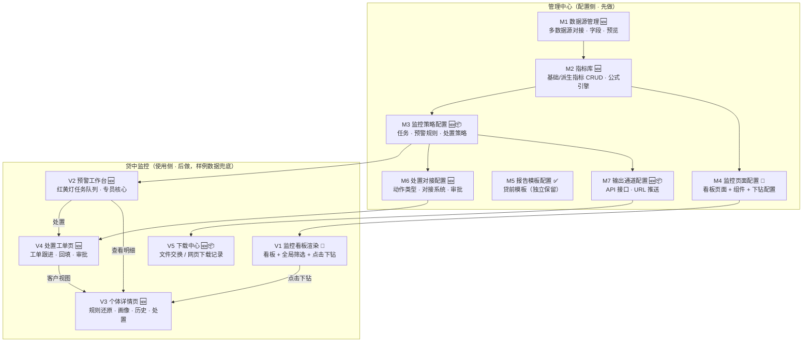
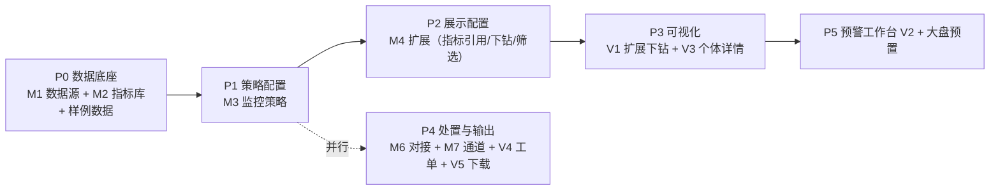

# 贷中监控 · 完整页面规划

> 定位：先做配置侧、再做使用侧；可视化页面的数据直接用样例数据兜底（配置即行为）。
> 原则：**不重复、不缺漏**——所有「已有」能力明确标注并继承，所有「占位菜单」合并归位，所有「缺失」补齐。
> 状态图例：✅ 已有可直接用 ｜ 🔧 已有需扩展 ｜ 🆕 新建 ｜ 📦 占位菜单合并归位

---

## 1. 现状盘点（先看清手里有什么）

| 现状 | 内容 | 状态 |
|------|------|------|
| 看板配置页 `cm:dashboard-config` | 页面管理 + 5 类图表组件配置 + 数据集管理（内置/API/SQL） | ✅ 已有，缺下钻/指标引用/全局筛选 |
| 报告模板配置页 `cm:report-template` | 贷前报告模板（sections/公式/评分形态/人工审核） | ✅ 已有，独立保留 |
| 7 个贷中看板 `cr:mid-*` | 监控任务/红黄灯预警/客群风险/单客风险/风险趋势/处置任务/处置记录，由 DashboardConfig 驱动渲染 | ✅ 已有，缺点击下钻 |
| 监控任务管理 `cm:mid-task-config` | — | 📦 占位页 |
| 监控任务日志 `cm:mid-task-log` | — | 📦 占位页 |
| 预警规则 `cm:mid-alert-config` | — | 📦 占位页 |
| 处置策略 `cm:mid-dispose-strategy` | — | 📦 占位页 |
| 结果输出 API `cm:mid-output-api` | — | 📦 占位页 |
| 结果输出推送 `cm:mid-output-push` | — | 📦 占位页 |
| 下载中心 `cm:mid-output-download` | — | 📦 占位页 |
| 指标库 / 数据源管理 | — | ❌ 缺 |
| 处置动作对接配置 | — | ❌ 缺 |
| 预警工作台 / 个体详情 / 处置工单 | — | ❌ 缺 |

**核心结论**：现有骨架已经把「贷中监控」的菜单占位都挂好了，本规划的任务是——**6 个占位菜单合并成 2 个真页面（策略配置、输出通道），新建 8 个缺失页面，扩展 2 个已有页面（看板配置、看板渲染）**。

---

## 2. 页面全景图

> V6 监控大盘不单列：用 M4 预置一个「监控大盘」看板（管理层视角），由 V1 渲染，零开发。

---

## 3. 页面清单总表

| 编号 | 页面 | 归属 | 状态 | 主要用途 | 使用角色 |
|------|------|------|------|---------|---------|
| M1 | 数据源管理 | 管理中心 | 🆕 | 对接多种数据源，为指标库提供字段 | 管理员 |
| M2 | 指标库 | 管理中心 | 🆕 | 定义可复用指标（基础+派生），全系统引用 | 管理员 |
| M3 | 监控策略配置 | 管理中心 | 🆕📦 | 配置监控任务 / 预警规则 / 处置策略 | 管理员 |
| M4 | 监控页面配置 | 管理中心 | 🔧 | 配置看板页面与组件（展示层） | 管理员 |
| M5 | 报告模板配置 | 管理中心 | ✅ | 贷前报告模板（现有，独立保留） | 管理员 |
| M6 | 处置对接配置 | 管理中心 | 🆕 | 处置动作类型 + 对接外部系统 + 审批规则 | 管理员 |
| M7 | 输出通道配置 | 管理中心 | 🆕📦 | API 接口 / URL 推送管理 | 管理员 |
| V1 | 监控看板渲染 | 贷中监控 | 🔧 | 查看配置好的页面指标数据，可下钻 | 专员/经理/管理层 |
| V2 | 预警工作台 | 贷中监控 | 🆕 | 红黄灯预警队列，专员处理入口 | 专员 |
| V3 | 个体详情页 | 贷中监控 | 🆕 | 单个客户的规则还原+画像+历史+处置 | 专员/经理 |
| V4 | 处置工单页 | 贷中监控 | 🆕 | 工单跟进、处置回填、审批 | 专员/经理/主管 |
| V5 | 下载中心 | 贷中监控 | 🆕📦 | 文件交换 / 网页下载的结果查看 | 专员/经理 |

---

## 4. 页面详述

### M1 数据源管理（🆕 新建）

**用途**：指标库的数据底座——「指标库可以对接多种数据源」由本页支撑。管理所有数据接入来源，统一字段口径。

| 功能点 | 说明 |
|--------|------|
| 数据源列表 | 名称 / 类型 / 连接状态（已连接·失败）/ 更新时间 / 字段数 |
| 新建数据源 | 类型选择：**本地样例（内置 JSON）** / API / 数据库（SQL 占位）/ 文件导入（CSV 占位） |
| 连接配置 | API：接口地址+鉴权+字段映射；SQL：连接串+查询语句（占位演示） |
| 字段清单 | 字段 key / 标签 / 类型（string·number·date）/ 维度 or 度量 / 单位 |
| 数据预览 | 前 N 行样例数据预览（本地样例源直接可见） |
| 同步 / 测试 | 手动触发同步、测试连接（Demo：模拟成功/失败） |

**关系**：M2 指标库从这里选字段；对应 0803 规划的 `datasets.json`（本地样例源）。数据来源标注：连接配置=蓝，样例数据=橘。

### M2 指标库（🆕 新建）

**用途**：指标作为「一等公民」全系统复用——配置一次，监控策略、看板、预警规则全部引用。对应同盾/神策式产品的指标库。

| 功能点 | 说明 |
|--------|------|
| 指标列表 | 名称 / 所属数据源 / 类型（基础·派生）/ 公式 / 单位 / 小数位 / **被引用次数** |
| 基础指标 | 选择数据源 → 选字段 → 选聚合（sum/count/avg/max/min/distinct） |
| 派生指标 | 公式编辑器（引用字段/指标 + 四则运算 + 函数 ratio/mom/yoy/cumsum），变量面板点击插入 |
| 实时预览 | 用该数据源样例数据计算并展示结果 |
| 分组 / 搜索 | 按业务分组（风险/经营）、按名称搜索 |
| 引用检查 | 删除被引用的指标 → 提示并阻止（列出引用它的策略/看板） |
| 复制 | 快速派生新指标 |

**关系**：M3 预警规则、M4 看板组件都从指标库取指标（替代现在 DashboardConfig 的「裸字段+聚合」）；对应 0803 规划 A 模块 + `metrics.json`。数据来源：配置=蓝。

### M3 监控策略配置（🆕 新建，合并 3 个占位菜单）

**用途**：回答「监控什么、怎么判、命中后怎么办」——把现有 `cm:mid-task-config`（监控任务）、`cm:mid-alert-config`（预警规则）、`cm:mid-dispose-strategy`（处置策略）三个占位菜单合并为一个页面的三个 tab。

**Tab 1 · 监控任务**：任务列表（名称/客群/扫描频次/状态/关联输出方式）+ 任务编辑——客群选择（全量在贷/按产品/按等级分层）、指标绑定（从 M2 选）、扫描频次（日/周/月）、关联输出方式（从 M7 选）。

**Tab 2 · 预警规则**：规则列表（指标 + 阈值 + 逻辑组合，从 M2 选指标）+ 红黄灯定级配置（行为评分区间 + 规则命中加权）+ 规则明细还原模板（预警事件快照字段）。

**Tab 3 · 处置策略**：预警等级 → 建议处置动作映射（红灯→预催+降额、黄灯→关注、机会信号→提额）；分派规则（按产品线/等级分派给专员/客户经理）。

**关系**：策略生效后产生预警（Demo 由样例数据模拟命中）；处置策略的「建议动作」由 M6 决定怎么落地。数据来源：配置=蓝。

### M4 监控页面配置（🔧 已有扩展）

**用途**：回答「监控结果怎么展示」——神策式看板配置，现有 `DashboardConfig` 已实现页面管理 + 5 类图表，本规划扩展三项：

| 已有（保留） | 新增扩展 |
|-------------|---------|
| 页面管理（增删改/启停/排序/分组/预览/恢复默认） | **B3 组件度量引用指标库**（从 M2 选指标，替代裸字段+聚合） |
| 组件配置（指标卡/折线/柱状/环形/数据表；维度/度量/筛选） | **B4 下钻配置**（无 / 明细列表 / 个体详情，绑定个体详情路由） |
| 数据集管理（内置 + API/SQL 注册） | **B5 看板全局筛选器**（日期/产品/客群/等级，联动全组件） |

**关系**：配置结果驱动 V1 渲染；对应 0803 规划 B 模块。数据来源：配置=蓝。

### M5 报告模板配置（✅ 已有，独立保留）

**用途**：贷前报告模板（现有 `ReportTemplate`），配置对外报告的 sections / 综合总分公式 / 评分卡形态 / 分值分段 / 人工审核流程。

**与贷中监控的关系（回应「报表配置能否放一起」）**：**不建议物理合并**——报告模板是「单份对外报告」范式，监控看板是「数据看板」范式，配置对象和渲染引擎都不同；两者同属管理中心「配置」归组、菜单相邻即可，都遵循「配置即渲染」同一产品理念。

### M6 处置对接配置（🆕 新建）

**用途**：回答「处置动作怎么落地到外部系统」——处置动作类型管理 + 对接系统管理 + 动作↔系统绑定 + 审批规则 + 模拟测试。

| 功能点 | 说明 |
|--------|------|
| 处置动作类型管理 | 动作库（关注/预催/降额/冻结/止付/促活/提额…）增删改，定义动作参数（额度调整比例、冻结期限、话术模板） |
| 对接系统管理 | 对接方清单：核心信贷系统 / 催收系统 / 营销系统 / 触达平台 / 审批流 / 工单系统，增删改 |
| 动作 ↔ 系统绑定 | 每个动作绑定执行系统 + 审批开关 + 触达开关（如：降额 → 核心信贷系统 + 需审批 + 通知客户） |
| 对接方式 | API / URL 推送 / 文件交换 / 网页下载，接口参数模板配置 |
| 审批规则 | 哪些动作要审批、审批人角色（主管） |
| 模拟测试 | Demo 核心：点「测试」→ 模拟执行轨迹（下发→审批→执行成功/失败），展示对接故事 |

**关系**：M3 处置策略 tab 决定「建议什么动作」，本页决定「动作怎么执行」——**一个管决策、一个管落地，不重复**；V4 处置工单执行时引用这里的配置。数据来源：配置=蓝 + 模拟执行记录=橘。

### M7 输出通道配置（🆕 新建，合并 2 个占位菜单）

**用途**：回答「监控结果怎么送出去」——合并现有 `cm:mid-output-api` + `cm:mid-output-push` 两个占位菜单为一页。

| Tab | 功能点 |
|-----|--------|
| API 接口 | 接口列表（名称/地址/鉴权方式/调用频率限制/最近调用时间），接口文档查看，调用记录 |
| URL 推送 | 推送订阅方管理（推送地址/推送内容范围/推送频次），推送历史 |

**关系**：M3 监控任务可关联输出方式；产生的结果文件/记录在 V5 下载中心查看。数据来源：配置=蓝。

### V1 监控看板渲染（🔧 已有扩展）

**用途**：数据可视化（用户 #5）——查看配置好的监控页面上的指标数据。现有 7 个看板（MidDashboardPage）继承，新增两项交互：

| 已有（保留） | 新增扩展 |
|-------------|---------|
| 7 个看板渲染（指标卡/折线/柱状/环形/表格） | **图表点击下钻**：点柱子/扇区/数据点/行 → 按维度值下钻明细列表或直接进 V3 个体详情 |
| 看板动态菜单（mergeMidMenu） | **全局筛选器**：顶部渲染配置的筛选（日期/产品/客群/等级），变更联动全部组件重算 |

**数据来源**：样例数据=橘（真实感由样例数据保证）+ 实时计算=灰（buildComputed 对样例行做聚合）。
**V6 监控大盘**：用 M4 预置一个「监控大盘」看板（预警量/红黄灯分布/命中规则 TOP/处置及时率），管理层查看，零开发。

### V2 预警工作台（🆕 新建）

**用途**：红黄灯预警的「任务队列」——风控专员的核心页面（区别于看板的统计视角，这里是逐条处理视角）。

| 功能点 | 说明 |
|--------|------|
| 预警列表 | 等级（红/黄）/ 场景 / 产品 / 状态（待处置·核实中·已解除·已升级·误报）筛选 |
| 统计头 | 今日新增红灯/黄灯数、待处置总数、处置及时率 |
| 预警行 | 客户（脱敏）/ 等级 / 场景 / 触发时间 / 建议动作（来自 M3 处置策略）/ 操作 |
| 行操作 | 查看明细（→V3）、立即处置（→V4 生成工单）、批量分派 |
| 规则还原入口 | 点开可预览命中规则快照（完整明细在 V3） |

**数据来源**：样例数据=橘（预警事件带规则明细快照）。

### V3 个体详情页（🆕 新建）

**用途**：单个客户的完整风险视图——「为什么红、以前怎么样、处理到哪了」。

| 功能点 | 说明 |
|--------|------|
| 客户画像卡 | 姓名(脱敏)/证件(脱敏)/产品/额度/在贷状态/风险等级 |
| 预警规则还原 | **核心卡片**：命中规则列表（规则名/指标值/阈值/结论）+ 行为评分（当前分 vs 客群均值 + 趋势） |
| 评分历史 | 折线图（12 个月行为分 vs 客群均值）+ 月度表 |
| 预警记录 | 时间/等级/场景/描述/处置状态 |
| 处置记录 | 时间/处置人/动作/结果/备注（来自 V4） |
| 处置操作 | 按钮按 M6 配置的动作渲染；点击 → 模拟对接执行（审批→执行→回填记录） |
| 钻入来源 | 顶部回显：来自「红黄灯预警 → 设备异常 → 个体」 |

**数据来源**：样例数据=橘（customers.json，0803 规划 G2）+ 实时=灰。

### V4 处置工单页（🆕 新建）

**用途**：专员/客户经理/主管的工单协作——跟进、回填、审批，让处置闭环真正流转。

| 功能点 | 说明 |
|--------|------|
| 我的工单 | 待跟进 / 待回填 / 已完成 三个队列（按角色：专员=处置工单，经理=核实工单，主管=审批工单） |
| 工单详情 | 客户（→V3）、预警、建议动作（M3）、对接配置（M6）摘要 |
| 处置回填 | 动作 / 结果（成功·失败·误报·升级）/ 备注 / 下次复查日 |
| 审批操作 | 降额/冻结/止付类工单：主管「通过 / 驳回」，通过后模拟对接执行 |
| 状态机 | 待处置 → 核实中 → 处置中 → 已解除 / 已升级 / 误报（操作日志留痕） |

**数据来源**：样例数据=橘（ds_dispose_task / ds_dispose_result）。

### V5 下载中心（🆕 新建，承接现有占位菜单）

**用途**：文件交换 / 网页下载形式的结果查看（对应同盾「多方式获取结果」中的文件与网页两种形态）。

| 功能点 | 说明 |
|--------|------|
| 文件任务列表 | 文件名 / 类型（预警清单·处置结果·监控报告）/ 生成时间 / 状态 / 下载 |
| 下载 / 预览 | 文件下载、在线预览（Demo：生成 CSV/JSON 样例） |
| 网页下载记录 | 网页端导出的历史记录 |

**关系**：M7 输出通道触发生成；数据来源：样例=橘。

---

## 5. 对用户三个问题的明确回答

| 问题 | 回答 |
|------|------|
| **2 和 3（数据监控配置 / 监控页面配置）可以一个页面吗？** | **建议分两页、归组相邻**。监控策略（M3）是「怎么监控」——逻辑配置（客群/规则/阈值/频次）；监控页面（M4）是「怎么看」——布局配置（图表/维度/筛选）。两者心智模型不同，且 M4 现有实现已稳定，强合并等于推倒重来。M3 与 M4 菜单放同一「监控配置」分组，页面间提供快捷跳转 |
| **4 报表配置能和现有模板配置放一起用吗？** | **不建议物理合并**。报告模板（M5）是「单份对外报告」范式（sections/公式/评分形态/人工审核），监控页面（M4）是「数据看板」范式（数据集/图表/下钻）；配置对象与渲染引擎都不同。两者共用「指标库」理念、同属管理中心配置归组即可 |
| **处置动作对接页面？** | M6 单独成页（你列的 #6），与 M3 的「处置策略」tab 分工明确：**M3 定「该做什么动作」，M6 定「动作怎么落地」**，一个管决策、一个管执行，不重复 |

---

## 6. 覆盖检查（不重复、不缺漏）

| 来源 | 需求 | 落点 |
|------|------|------|
| 你的 #1 指标库（含多数据源） | 指标库增删改查完整、可对接多种数据源 | M1（数据源）+ M2（指标库） |
| 你的 #2 数据监控配置 | 监控任务/规则/处置策略 | M3（合并 3 个占位菜单） |
| 你的 #3 监控页面配置 | 看板布局配置 | M4（已有扩展） |
| 你的 #4 报表配置 | 与模板配置的关系 | M4/M5（回答见上） |
| 你的 #5 数据可视化 | 查看配置页面的指标数据 | V1（已有扩展）+ 下钻 |
| 你的 #6 处置动作对接 | 动作对接外部系统 | M6 |
| 0803 规划 A/B/C/D/E/F/G | 指标库/看板配置/渲染/下钻/个体详情/JSON 化/样例 | M1/M2/M4/V1/V3 + 样例数据 |
| 讨论过的处置闭环 | 工单/回填/审批/状态机 | V4 + V3 |
| 讨论过的结果输出 | API/URL/文件/网页 | M7 + V5 |
| 讨论过的角色 | 管理员/专员/经理/主管/管理层 | 见每页「使用角色」 |

**明确不做（Demo 口径）**：用户与权限管理（权限写死）、调度跑批运维（任务状态在 M3 展示模拟）、真实外部系统集成（M6 模拟对接）。

---

## 7. 实施顺序建议

- **P0-P1**：先完成配置侧核心（数据源→指标→策略），所有配置落本地 JSON；
- **P2-P3**：展示侧——看板配置引用指标、渲染页支持下钻到个体详情；
- **P4**：处置闭环与输出通道（M6 模拟对接是演示亮点）；
- **P5**：预警工作台与大盘收尾。

每阶段完成即可独立演示（配置→样例数据→可视化链路随时可通）。
