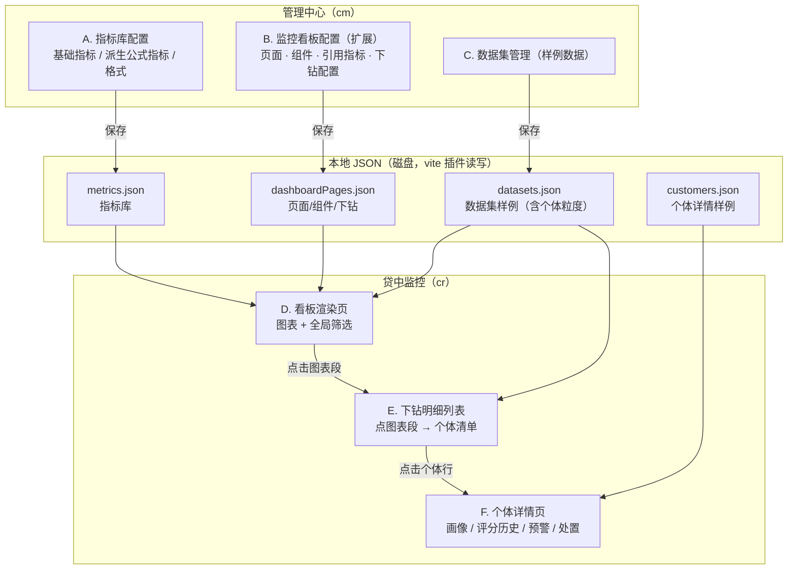
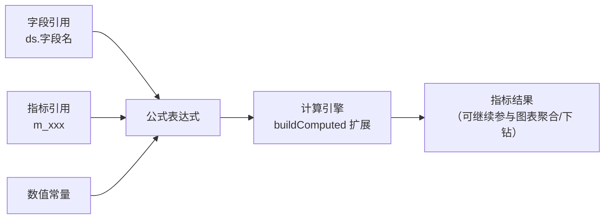
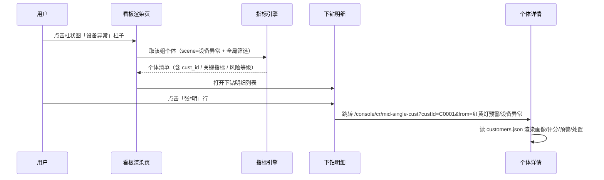

# 贷中监控 · 神策式 BI 规划（0803 规划稿）

> 目标：把「贷中监控」做成一个 **配置驱动的 BI 产品**——像神策那样，指标可自定义、可复用，图表可下钻，最终定位到单个客户。
> 本文从页面拆到最小功能单元，供实施时逐项勾选。**所有配置与样例数据一律保存到本地 JSON**（参照模板 `templateSeed.json` 的 vite 插件读写模式）。

---

## 1. 现状盘点（先看清有什么）

| # | 已有能力 | 文件 | 状态 |
|---|---------|------|------|
| 1 | 神策式数据模型：数据集(字段 dim/measure) / 组件(图表) / 维度分组 / 度量聚合 / 筛选 | `dashboardData.ts` | ✅ 已有 |
| 2 | 计算引擎 `buildComputed`（维度分组 + 聚合 + 筛选 → 图表数据） | `dashboardData.ts` | ✅ 已有 |
| 3 | 7 个默认看板 + 10 个内置数据集（任务/预警/客群/单客/趋势/处置） | `dashboardData.ts` `DEFAULT_DASHBOARDS` | ✅ 已有 |
| 4 | 管理中心配置页（页面管理 + 组件配置） | `DashboardConfig.tsx` | ✅ 已有 |
| 5 | 贷中监控渲染页（指标卡/折线/柱状/环形/表格） | `MidDashboardPage.tsx` | ✅ 已有 |
| 6 | 看板 → 动态菜单（`mergeMidMenu` 按配置生成菜单） | `dashboardData.ts` | ✅ 已有 |
| 7 | **持久化是 localStorage**（`zd-dashboard-pages-v2`） | `dashboardData.ts` | ⚠️ 要改成本地 JSON |
| 8 | **指标只有"裸字段+聚合"**（sum/count/avg/max/min/distinct），无派生/公式指标、无指标库 | — | ❌ 缺 |
| 9 | **图表无点击交互**，无下钻、无"定位到个体" | `MidDashboardPage.tsx` | ❌ 缺 |
| 10 | **无个体详情页**（客户画像/评分历史/预警/处置） | — | ❌ 缺 |
| 11 | **样例数据在代码里**（BUILTIN_DATASETS），无本地 JSON、无个体粒度 | `dashboardData.ts` | ❌ 缺 |

**结论**：地基（配置驱动渲染）已经有了，神策 BI 的三大核心缺口是 **①指标库 ②下钻到个体 ③本地 JSON 化 + 样例数据**。本规划围绕这三点补齐，其余"继承"现有结构，不推倒重来。

---

## 2. 总体架构



**一条主链路（神策核心价值）**：`看板图表（某客群/某场景某段）→ 点击 → 下钻明细列表（该分组下的个体）→ 点击个体 → 个体详情页（画像+历史+预警+处置）`。整条链路全部由配置（指标 + 下钻）驱动，无硬编码。

---

## 3. 功能模块拆解（最小功能单元，实施时逐项勾选）

### A. 管理中心 · 指标库配置（新增，神策"指标"一等公民）

> 神策里"指标"是独立可复用的对象：配置一次，全看板引用。现在 `WidgetMeasure` 只是"字段+聚合"，升级为"指标"后：`指标 = 基础指标(字段+聚合) 或 派生指标(公式)`，组件引用指标而不是裸字段。

- [ ] **A1 指标列表页**
  - [ ] A1.1 表格展示全部指标：名称 / 所属数据集 / 类型（基础·派生）/ 聚合或公式 / 单位 / 格式
  - [ ] A1.2 按数据集筛选、按名称搜索
  - [ ] A1.3 新建指标（进入编辑器）
  - [ ] A1.4 编辑指标（进入编辑器）
  - [ ] A1.5 删除指标（**引用检查**：被看板组件引用的指标提示，阻止删除或级联确认）
  - [ ] A1.6 复制指标（快速派生新指标）
- [ ] **A2 指标编辑器**
  - [ ] A2.1 基本信息：名称 / 描述 / 所属数据集 / 单位(元/万/%/无) / 小数位
  - [ ] A2.2 基础指标模式：选择字段 → 选择聚合（sum/count/avg/max/min/distinct）
  - [ ] A2.3 派生指标模式：**公式编辑器**（见 §4 指标公式引擎）
  - [ ] A2.4 公式变量面板：当前数据集字段 + 全库指标，点击插入
  - [ ] A2.5 实时预览：用该数据集样例数据计算并展示结果
  - [ ] A2.6 保存 → 写 `metrics.json`（本地 JSON）
- [ ] **A3 指标引用**
  - [ ] A3.1 看板组件"度量"配置可引用指标库（替代裸字段+聚合）——见 B3
  - [ ] A3.2 指标被引用处的高亮提示（配置页可追踪"被哪些组件使用"）

### B. 管理中心 · 监控看板配置（在现有 `DashboardConfig` 上扩展）

- [ ] B1 页面管理：新建 / 复制 / 启用停用 / 排序 / 删除（✅ 已有，保留）
- [ ] B2 组件配置：数据集 / 图表类型 / 维度 / 筛选（✅ 已有，保留）
- [ ] **B3 组件引用指标**：度量项支持两种来源——①指标库选择（推荐）②裸字段+聚合（兼容旧）
- [ ] **B4 组件下钻配置（新）**：
  - [ ] B4.1 下钻开关：无 / 明细列表 / 个体详情
  - [ ] B4.2 下钻到"明细列表"：选下钻数据集 + 行主键字段（如 cust_id）+ 明细标题
  - [ ] B4.3 下钻到"个体详情"：直接绑定个体详情路由（一般先经过明细列表，再进个体）
  - [ ] B4.4 下钻参数传递：点击的维度值（如 scene=设备异常）作为筛选条件传给明细列表
- [ ] **B5 看板级全局筛选器（新）**：日期范围 / 产品 / 客群 / 预警等级——配置生效范围（本页所有组件联动），渲染页顶部展示
- [ ] B6 配置保存 → 写 `dashboardPages.json`（本地 JSON，替换 localStorage）

### C. 贷中监控 · 看板渲染页（在现有 `MidDashboardPage` 上扩展交互）

- [ ] C1 图表渲染（✅ 已有：指标卡/折线/柱状/环形/表格）
- [ ] **C2 图表点击下钻（新）**：
  - [ ] C2.1 柱状图：点击某根柱子 → 按该维度值下钻
  - [ ] C2.2 环形图：点击某扇区 → 按该维度值下钻
  - [ ] C2.3 折线图：点击某数据点 → 按该点维度值下钻
  - [ ] C2.4 指标卡：点击 → 直接下钻（无维度，全量明细）
  - [ ] C2.5 表格：行点击 → 下钻（若配置了个体详情则直接进个体）
  - [ ] C2.6 无下钻配置的组件：点击无反应（不弹窗）
- [ ] **C3 全局筛选器（新）**：顶部渲染配置的筛选器，变更 → 所有组件重算（buildComputed 带全局筛选）
- [ ] C4 下钻状态回显：当前下钻路径（如：红黄灯预警 → 设备异常场景 → 个体列表），可"返回/清空下钻"

### D. 下钻明细列表（新，弹窗或独立页）

- [ ] D1 从图表点击触发，携带维度筛选条件（如 scene=设备异常 + 全局筛选）
- [ ] D2 表格展示个体清单：个体ID / 姓名(脱敏) / 该维度命中字段 / 关键指标值 / 风险等级 / 操作
- [ ] D3 行点击 → 跳个体详情页（带 custId + 来源回显参数）
- [ ] D4 空态：该分组无个体
- [ ] D5 来源面包屑（从哪个看板/哪个指标钻入）

### E. 个体详情页（新）

- [ ] E1 客户画像卡：姓名(脱敏) / 证件号(脱敏) / 产品 / 额度 / 在贷状态 / 风险等级
- [ ] E2 风险评分历史：折线图（行为分 vs 客群均值）+ 月度观测表
- [ ] E3 预警记录列表：时间 / 等级(红黄蓝) / 场景 / 预警描述 / 处置状态
- [ ] E4 处置记录列表：时间 / 处置人 / 处置方式 / 处置结果 / 备注
- [ ] E5 钻入来源回显：顶部显示"来自：红黄灯预警 → 设备异常 → 个体"
- [ ] E6 数据来自 `customers.json`（按 custId 查）

### F. 数据层 · 本地 JSON 化（核心工程）

- [ ] F1 `metrics.json`：指标库
- [ ] F2 `dashboardPages.json`：页面/组件/下钻（取代 localStorage）
- [ ] F3 `datasets.json`：数据集样例（含**个体粒度**明细行，供下钻）
- [ ] F4 `customers.json`：个体详情样例
- [ ] F5 vite 插件读写接口（参照 `/api/load-templates` 模式）：
  - [ ] F5.1 `/api/load-metrics` + `/api/save-metrics`
  - [ ] F5.2 `/api/load-dashboards` + `/api/save-dashboards`
  - [ ] F5.3 `/api/load-datasets` + `/api/save-datasets`
  - [ ] F5.4 `/api/load-customers` + `/api/save-customers`
- [ ] F6 兼容迁移：localStorage 旧数据 → 首次加载自动迁入 `dashboardPages.json`（或直接弃用 localStorage，保留内置默认）

### G. 样例数据（监控 + 个体）

- [ ] G1 数据集样例扩充为**个体粒度**：现有 10 个数据集每行加 `cust_id / cust_name(脱敏)`，保证每个维度值都能下钻出个体
  - [ ] G1.1 ds_task（监控任务）→ 任务级，个体粒度弱，可不下钻
  - [ ] G1.2 ds_alert（预警）→ 每行 = 一条预警 = 一个个体 ⭐下钻主力
  - [ ] G1.3 ds_alert_daily / ds_segment / ds_risk_band / ds_behavior / ds_migration_* → 尽量带个体样例
  - [ ] G1.4 ds_dispose_task / ds_dispose_result → 每行 = 处置记录 = 一个个体
- [ ] G2 个体详情样例（`customers.json`，约 20 人）：画像 + 12 个月评分历史 + 3~8 条预警 + 0~5 条处置
- [ ] G3 与 `infoVerify222Data.json` 的客户样例口径一致（姓名脱敏格式统一：张*明）

---

## 4. 指标公式引擎（派生指标）



**公式语法**（BNF 简化）：

```
表达式  := 项 ( ('+'|'-'|'*'|'/') 项 )*
项      := 数字 | 字段引用(字段名) | 指标引用(m_指标id) | 函数(参数) | '(' 表达式 ')'
函数    := abs( ) | round( ,小数位) | ratio(分子,分母) | mom(指标) 环比 | yoy(指标) 同比 | cumsum(指标) 累计
```

**示例**（贷中监控常用派生指标）：

| 指标 | 公式 | 说明 |
|------|------|------|
| 逾期率 | `m_overdue_amt / m_loan_balance * 100` | 逾期金额占比 |
| 预警环比 | `mom(m_alert_cnt)` | 预警量环比 |
| 处置有效率 | `m_effective_cnt / m_dispose_cnt * 100` | 处置成功率 |
| 人均授信 | `m_total_credit / m_cust_cnt` | 均值派生 |
| 迁移率 | `m_up_migrate / m_cust_cnt * 100` | 风险上迁率 |

**实现位置**：`buildComputed` 的度量解析增加"指标引用 → 取 metrics.json 定义 → 基础聚合或公式求值"，公式求值用轻量递归下降解析器（项目内新增 `metricFormula.ts`，不引第三方）。

---

## 5. 数据模型（JSON 结构示意）

```jsonc
// metrics.json —— 指标库
{
  "metrics": [
    {
      "id": "m_alert_cnt",
      "name": "预警数",
      "datasetId": "ds_alert",
      "type": "base",                    // base=基础 | derived=派生
      "field": "alert_id",
      "agg": "count",                    // sum/count/avg/max/min/distinct
      "unit": "", "precision": 0,        // 单位、小数位
      "formula": null                    // derived 时：m_overdue_amt / m_loan_balance * 100
    },
    { "id": "m_overdue_rate", "name": "逾期率", "datasetId": "ds_loan", "type": "derived",
      "formula": "m_overdue_amt / m_loan_balance * 100", "unit": "%", "precision": 2 }
  ]
}

// dashboardPages.json —— 页面/组件/下钻（与现有 DashboardPage 兼容 + 新增字段）
{
  "pages": [
    {
      "id": "db-mid-alert", "key": "cr:mid-alert", "name": "红黄灯预警", "section": "贷中监控",
      "filters": [ { "id": "flt_date", "label": "日期范围", "kind": "dateRange", "applyTo": "all", "datasetField": "alert_date" } ],
      "widgets": [
        {
          "id": "w4", "type": "donut", "title": "今日预警场景分布",
          "datasetId": "ds_alert", "dimensions": ["scene"],
          "measures": [ { "metricId": "m_alert_cnt" } ],          // 引用指标库
          "drill": {                                               // 下钻配置（新）
            "type": "list",                                       // none | list | detail
            "listDatasetId": "ds_alert",                          // 明细数据集（须含个体行）
            "rowKey": "cust_id",                                  // 个体主键
            "detailRoute": "/console/cr/mid-single-cust",         // 个体详情路由
            "title": "预警个体明细"
          }
        }
      ]
    }
  ]
}

// datasets.json —— 数据集样例（现有 Dataset + 个体粒度行）
{ "datasets": [
  { "id": "ds_alert", "name": "预警明细", "fields": [
      { "key": "cust_id", "name": "客户ID", "kind": "dim", "type": "string" },
      { "key": "cust_name", "name": "客户姓名", "kind": "dim", "type": "string" },
      { "key": "scene", "name": "预警场景", "kind": "dim", "type": "string" },
      { "key": "alert_id", "name": "预警ID", "kind": "measure", "type": "string" },
      { "key": "alert_date", "name": "预警日期", "kind": "dim", "type": "date" }
    ],
    "rows": [ { "cust_id": "C0001", "cust_name": "张*明", "scene": "设备异常", "alert_id": "A10001", "alert_date": "2026-07-29" } ]
  }
]}

// customers.json —— 个体详情样例
{ "customers": [
  { "custId": "C0001", "name": "张*明", "idCard": "3301**********1234", "product": "信用贷",
    "amount": 80000, "loanStatus": "在贷", "riskLevel": "高风险",
    "scoreHistory": [ { "month": "2026-01", "score": 68, "cohortAvg": 75 }, ... 12 条 ],
    "alerts": [ { "time": "2026-07-29", "level": "红", "scene": "设备异常", "desc": "...", "status": "待处置" } ],
    "disposes": [ { "time": "2026-07-29", "operator": "张三", "action": "电话核实", "result": "确认异常", "note": "..." } ]
  }
]}
```

---

## 6. 下钻链路（核心交互，神策式）



**配置即行为**：明细列、个体主键、详情路由全部来自 `widget.drill` 配置，改配置即改下钻行为，不写死。

---

## 7. 页面与路由清单

| 路由 key | 页面 | 模块 | 归属 |
|----------|------|------|------|
| `cm:metric-config`（新） | 指标库配置（列表+编辑器） | A | 管理中心·公共配置 |
| `cm:dashboard-config`（已有，扩展） | 监控看板配置（+指标引用+下钻+全局筛选） | B | 管理中心·公共配置 |
| `cr:mid-*`（已有） | 7 个看板渲染页（+点击下钻+全局筛选） | C | 贷中监控 |
| `cr:mid-single-cust`（新） | 个体详情页 | E | 贷中监控·客群风险 |
| 下钻明细列表 | 弹窗内嵌（复用 ApprovalModal 式浮层） | D | 贷中监控 |

---

## 8. 实施阶段（每阶段可独立验收）

| 阶段 | 内容 | 验收标准 |
|------|------|---------|
| **P0 数据层** | F 全部（4 个 JSON + vite 4 组接口）+ G 样例数据；metrics/datasets/customers 先落地 | 管理中心能读写 JSON；localStorage 废弃 |
| **P1 指标库** | A1/A2 指标列表+编辑器（基础+派生公式引擎）+ A3 引用 | 管理中心能建"逾期率"公式指标并预览 |
| **P2 下钻** | B3/B4 配置（引用指标+下钻配置）+ C2/D 渲染交互 | 图表点击出个体清单，点行进个体详情 |
| **P3 个体详情 + 全局筛选** | E 个体详情页 + B5/C3 全局筛选器 + G2 个体样例 | 完整链路：图表→个体→画像可走通 |
| **P4 打磨** | 指标引用追踪、下钻面包屑、空态、配色一致性 | 全链路体验顺畅，观感继承现有 |

---

## 9. 决策点（实施前需你拍板）

1. **指标库入口**：新建 `cm:metric-config`（独立菜单"指标库"）放管理中心公共配置，还是并入现有"数据看板配置"页做成 tab？（建议独立菜单，神策式，指标跨看板复用）
2. **下钻明细形式**：弹窗浮层（不动页面）还是独立页？（建议弹窗，轻量；个体详情独立页）
3. **个体详情归属菜单**：挂在"客群风险"分组下，还是仅由下钻进入（不出现在菜单）？（建议仅由下钻进入，菜单保持 7 个看板干净）
4. **样例数据口径**：个体样例与信息核验222 的客户（张*明等）共用一套脱敏身份，便于演示闭环？
5. **派生指标公式引擎**：轻量自研递归解析（推荐，无依赖）还是引第三方（不建议，工程重）？

---

## 10. 与现有系统的关系（继承原则）

- **渲染页**：`MidDashboardPage.tsx` 继承，只加"点击下钻 + 全局筛选"，不动渲染骨架
- **配置页**：`DashboardConfig.tsx` 继承，加"指标引用 / 下钻 / 全局筛选"三块配置 UI
- **引擎**：`buildComputed` 继承，度量解析扩展"指标引用 + 公式求值"
- **持久化**：参照 `templateStore.ts` + `vite.config.js` persistPlugin 模式，新增 4 组接口
- **观感**：组件样式全部用现有 `components/ui`（Panel/StatCard/DataTable）+ `components/charts`，不新造
